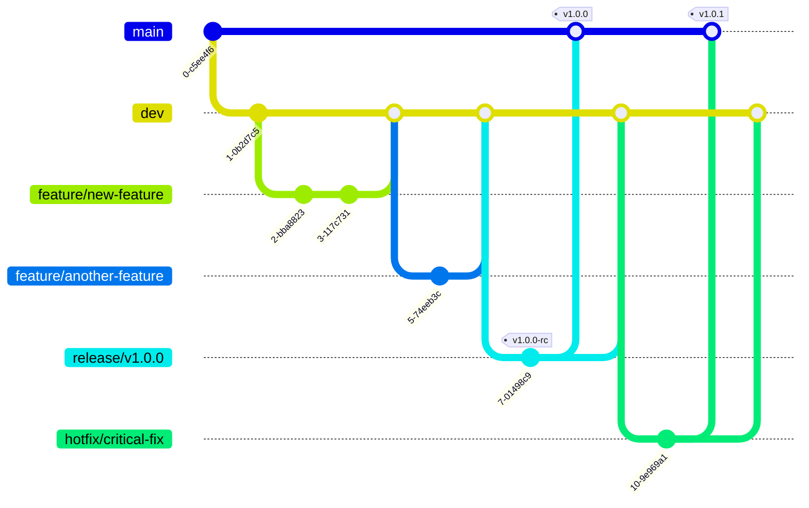

# Contributing to CodeMap

First off, thank you for considering contributing to CodeMap! We welcome contributions from everyone, and we're excited to see how you can help make this AI-powered dever toolkit even better.

This document provides guidelines for contributing to the project. Please read it carefully to ensure a smooth and effective contribution process.

## Table of Contents

- [Contributing to CodeMap](#contributing-to-codemap)
  - [Table of Contents](#table-of-contents)
  - [How Can I Contribute?](#how-can-i-contribute)
    - [Reporting Bugs](#reporting-bugs)
    - [Suggesting Enhancements](#suggesting-enhancements)
    - [Code Contributions](#code-contributions)
  - [Getting Started](#getting-started)
  - [Branching Strategy (Simplified Git Flow)](#branching-strategy-simplified-git-flow)
    - [Core Branches](#core-branches)
    - [Supporting Branches](#supporting-branches)
    - [Workflow Examples](#workflow-examples)
  - [Code Contribution Workflow](#code-contribution-workflow)
  - [Coding Standards](#coding-standards)
  - [Testing](#testing)
  - [Commit Message Guidelines](#commit-message-guidelines)
  - [Pull Request Process](#pull-request-process)
  - [Code of Conduct](#code-of-conduct)
  - [License](#license)
  - [Questions?](#questions)

## How Can I Contribute?

### Reporting Bugs

If you encounter a bug, please help us by reporting it!

1.  **Check Existing Issues:** Before creating a new issue, please search the [GitHub Issues](https://github.com/SarthakMishra/codemap/issues) to see if the bug has already been reported.
2.  **Create a New Issue:** If the bug hasn't been reported, create a new issue. Please include:
    *   A clear and descriptive title.
    *   Your operating system and Python version.
    *   Steps to reproduce the bug reliably.
    *   What you expected to happen.
    *   What actually happened (including any error messages or tracebacks).
    *   Screenshots or code snippets if relevant.

### Suggesting Enhancements

We welcome suggestions for new features or improvements to existing ones.

1.  **Check Existing Issues/Discussions:** Search the [GitHub Issues](https://github.com/SarthakMishra/codemap/issues) and [Discussions](https://github.com/SarthakMishra/codemap/discussions) to see if your idea has already been proposed.
2.  **Create a New Issue/Discussion:** If not, open a new issue or start a discussion thread. Describe:
    *   The enhancement you're proposing.
    *   The problem it solves or the use case it addresses.
    *   Any potential implementation ideas (optional).

### Code Contributions

If you'd like to contribute code (bug fixes, new features), please follow the workflow outlined below.

## Getting Started

Before you start coding, make sure you have set up your devment environment correctly.

1.  **Prerequisites:** Ensure you have Python (3.12+), [Task](https://taskfile.dev/installation/), and [uv](https://github.com/astral-sh/uv#installation) installed.
2.  **Follow Setup Guide:** Refer to the [Development Setup section in the README.md](./README.md#devment-setup) for detailed instructions on cloning the repository, setting up the virtual environment, and installing dependencies.

## Branching Strategy (Simplified Git Flow)

We use a simplified Git Flow model to manage branches and releases.



### Core Branches

-   **`main`**:
    -   Represents the latest **stable production-ready** release.
    -   All commits on `main` should correspond to a tagged release version (e.g., `v1.0.0`).
    -   Protected by CI checks. Direct pushes are discouraged; merges happen via `release` or `hotfix` branches.
-   **`dev`**:
    -   The primary integration branch for **ongoing devment** and upcoming features.
    -   Reflects the latest devment state, potentially including pre-release versions (e.g., `v1.1.0-alpha`).
    -   All feature branches are merged into `dev`.
    -   Continuously tested via CI.

### Supporting Branches

-   **Feature branches (`feature/*`)**:
    -   Branched off `dev`.
    -   Used for deving new features or significant changes.
    -   Named descriptively (e.g., `feature/add-pr-update-command`).
    -   Merged back into `dev` via Pull Requests (PRs).
-   **Release branches (`release/*`)**:
    -   Branched off `dev` when preparing for a new stable release.
    -   Used for final testing, documentation updates, and version bumping (e.g., `release/v1.2.0`).
    -   Merged into `main` (and tagged) and back into `dev`.
-   **Hotfix branches (`hotfix/*`)**:
    -   Branched off `main`.
    *   Used for critical bug fixes needed in the production version.
    *   Merged into `main` (and tagged) and back into `dev`.

### Workflow Examples

1.  **New Feature Development**:
    ```bash
    # Start from the dev branch
    git checkout dev
    git pull origin dev

    # Create your feature branch
    git checkout -b feature/your-feature-name

    # --- Make your changes ---

    # Push your feature branch
    git push -u origin feature/your-feature-name

    # Open a Pull Request to merge `feature/your-feature-name` into `dev`
    ```

2.  **Release Preparation (Maintainer Task)**:
    ```bash
    git checkout dev
    git checkout -b release/v1.3.0
    # Bump version, finalize docs, test
    # ...
    git checkout main
    git merge --no-ff release/v1.3.0
    git tag -a v1.3.0 -m "Version 1.3.0 Release"
    git push origin main --tags
    git checkout dev
    git merge --no-ff release/v1.3.0 # Merge back changes
    git push origin dev
    git branch -d release/v1.3.0 # Delete release branch
    ```

3.  **Hotfix (Maintainer Task / Urgent Contributor Task)**:
    ```bash
    git checkout main
    git checkout -b hotfix/critical-bug-fix
    # Fix the bug, commit using `codemap commit`
    # ...
    git checkout main
    git merge --no-ff hotfix/critical-bug-fix
    git tag -a v1.3.1 -m "Hotfix for critical bug"
    git push origin main --tags
    git checkout dev
    git merge --no-ff hotfix/critical-bug-fix # Merge back changes
    git push origin dev
    git branch -d hotfix/critical-bug-fix # Delete hotfix branch
    ```

## Code Contribution Workflow

1.  **Fork & Clone:** Fork the repository on GitHub and clone your fork locally.
    ```bash
    git clone https://github.com/YOUR_USERNAME/codemap.git
    cd codemap
    git remote add upstream https://github.com/SarthakMishra/codemap.git
    ```
2.  **Setup:** Follow the [Development Setup](./README.md#devment-setup) instructions.
3.  **Branch:** Create a new branch based on the correct base branch (`dev` for features/improvements, `main` only for agreed-upon hotfixes).
    ```bash
    # For features/improvements
    git checkout dev
    git pull upstream dev # Keep dev up-to-date
    git checkout -b feature/your-descriptive-name

    # For hotfixes (usually maintainers)
    # git checkout main
    # git pull upstream main
    # git checkout -b hotfix/your-fix-name
    ```
4.  **Code:** Make your changes. Write clean, well-commented code. Add or update tests as necessary.
5.  **Format & Lint:** Ensure your code adheres to the project's style guidelines.
    ```bash
    task format
    task lint
    # Or run all checks
    task ci
    ```
6.  **Test:** Run the test suite to ensure your changes haven't broken anything.
    ```bash
    task test
    # Check coverage
    task coverage
    ```
7.  **Commit:** Commit your changes using meaningful commit messages. **We strongly encourage using the `codemap commit` command** to generate conventional commit messages.
    ```bash
    # Stage your changes
    git add .
    # Use the interactive commit tool
    codemap commit
    # Or if you prefer manual commits, follow conventional commit format
    # git commit -m "feat(cli): add option for custom output format"
    ```
8.  **Push:** Push your branch to your fork.
    ```bash
    git push -u origin feature/your-descriptive-name
    ```
9.  **Pull Request:** Open a Pull Request (PR) from your fork's branch to the `SarthakMishra/codemap` `dev` branch (or `main` for hotfixes). See [Pull Request Process](#pull-request-process).

## Coding Standards

-   **Style:** Follow PEP 8 guidelines. We use `ruff` for formatting and linting, and `isort` for import sorting. Run `task format` and `task lint` before committing.
-   **Type Hinting:** Use Python type hints for function signatures and variables where appropriate. We use `pyright` for static type checking (`task typecheck`).
-   **Simplicity:** Keep code clear, concise, and easy to understand.

## Testing

-   New features **must** include corresponding tests.
-   Bug fixes **should** include tests that demonstrate the bug and verify the fix.
-   We use `pytest` for testing and `pytest-cov` for coverage.
-   Run tests using `task test`.
-   Ensure your changes maintain or increase test coverage (`task coverage`).
-   All tests must pass (`task ci`) before a PR can be merged.

## Commit Message Guidelines

We follow the [Conventional Commits](https://www.conventionalcommits.org/en/v1.0.0/) specification. This helps automate changelog generation and provides a clear history.

-   **Use `codemap commit`:** The easiest way to comply is by using the built-in `codemap commit` command, which guides you through creating compliant messages.
-   **Manual Format:** If committing manually, the format is:
    ```
    <type>[optional scope]: <description>

    [optional body]

    [optional footer(s)]
    ```
-   **Types:** Use the types defined in the [`.codemap.yml`](./.codemap.yml) configuration (e.g., `feat`, `fix`, `docs`, `style`, `refactor`, `perf`, `test`, `build`, `ci`, `chore`).
-   **Scope:** An optional scope can provide context (e.g., `cli`, `docs`, `git`, `llm`).
-   **Description:** A concise summary of the change in the imperative mood (e.g., "add", "fix", "update" not "added", "fixed", "updated").

## Pull Request Process

1.  **Target Branch:** Ensure your PR targets the correct base branch (`dev` for most contributions, `main` only for approved hotfixes).
2.  **Title & Description:** Provide a clear and descriptive title for your PR. The description should explain:
    *   What changes were made.
    *   Why these changes were necessary (link to relevant issues using `Fixes #123` or `Related to #456`).
    *   How the changes were tested.
3.  **CI Checks:** Ensure all automated checks (linting, testing, type checking) pass.
4.  **Review:** A maintainer will review your PR. Be prepared to discuss your changes and make adjustments based on feedback.
5.  **Merging:** Once approved and all checks pass, a maintainer will merge your PR.

## Code of Conduct

This project adheres to a Code of Conduct. We expect all contributors to follow it to ensure a welcoming and inclusive environment. Please read [CODE_OF_CONDUCT.md](./CODE_OF_CONDUCT.md) (You'll need to create this file, often based on the Contributor Covenant template).

## License

By contributing to CodeMap, you agree that your contributions will be licensed under the [MIT License](./LICENSE) that covers the project.

## Questions?

If you have questions about contributing, feel free to open an issue or start a discussion on the [GitHub repository](https://github.com/SarthakMishra/codemap).

Thank you for contributing!
